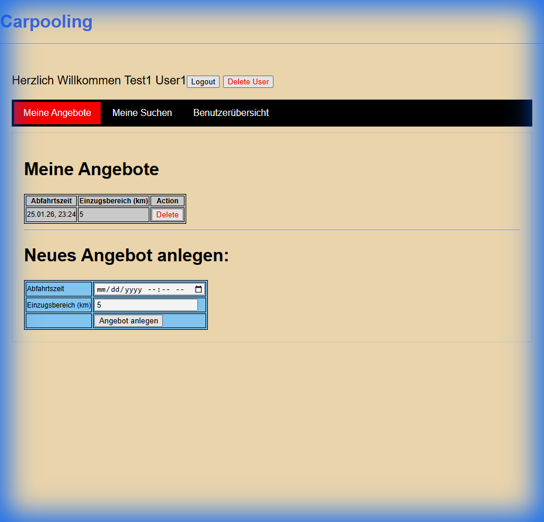
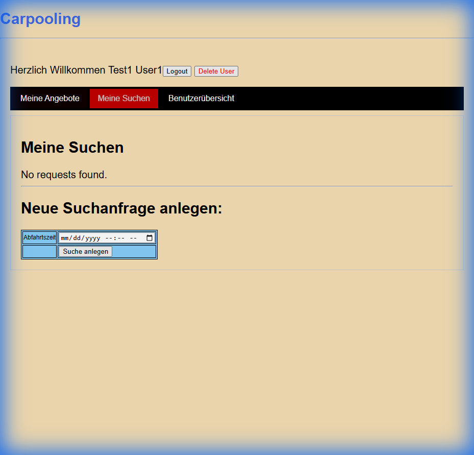
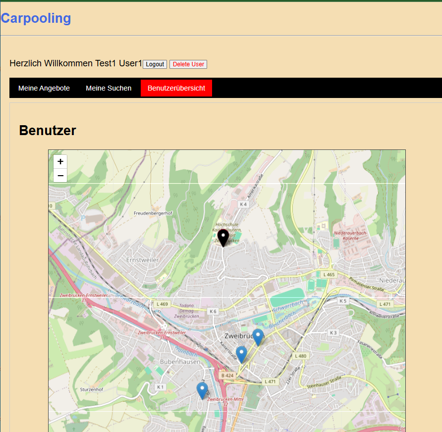

# RideShare Application

RideShare is a modern, RESTful application designed to connect drivers with passengers. Built with reliability and ease of use in mind, it allows users to publish ride offers, search for available carpools, and manage their travel plans efficiently. The platform leverages location-based services to find the best matches for your journey.

## Quick Start Guide

### 1. Start the Application
Run the following commands to build and launch the project using Docker:

```bash
git clone <repository-url>
cd RideShare
docker-compose up --build -d
```

The app will be available at [http://localhost:8080](http://localhost:8080).

### 2. Login & Test Users
The database is pre-populated with several test users (e.g., `test1`, `test2`, ... `test13`) to demonstrate matching algorithms.

**Note**: To access the system, please **Register** a new user on the login screen. The pre-loaded users are primarily for demonstrating ride matching and proximity features.

## Project Showcase

### Dashboard
Manage your rides and view active offers.


### Ride Requests
Easily find or request rides based on your specific travel needs.


### Interactive Map
Visualize rides and users near you.


## Technologies

This project is built using:
*   **Java 21** & **Spring Boot 3.4.4** (Backend)
*   **MySQL 8.3.0** (Database)
*   **JPA/Hibernate** (ORM)
*   **Docker** & **Docker Compose** (Containerization)
*   **Maven** (Build Tool)
